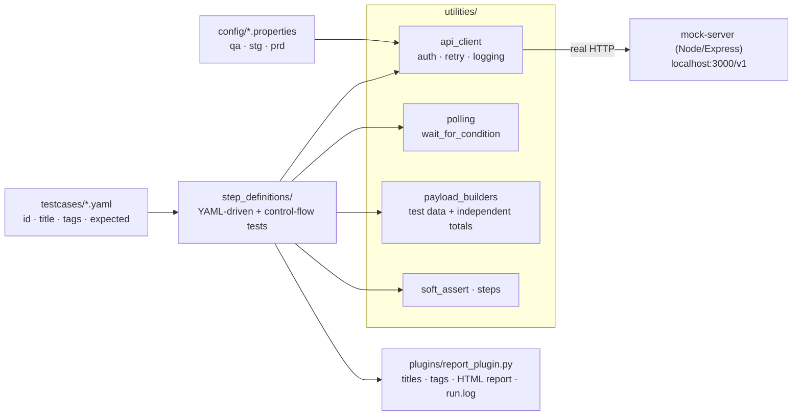
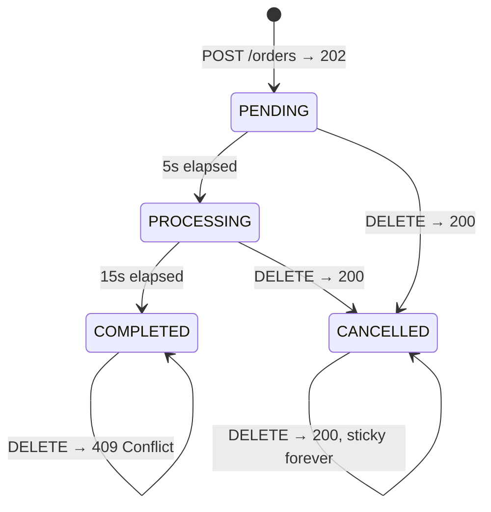
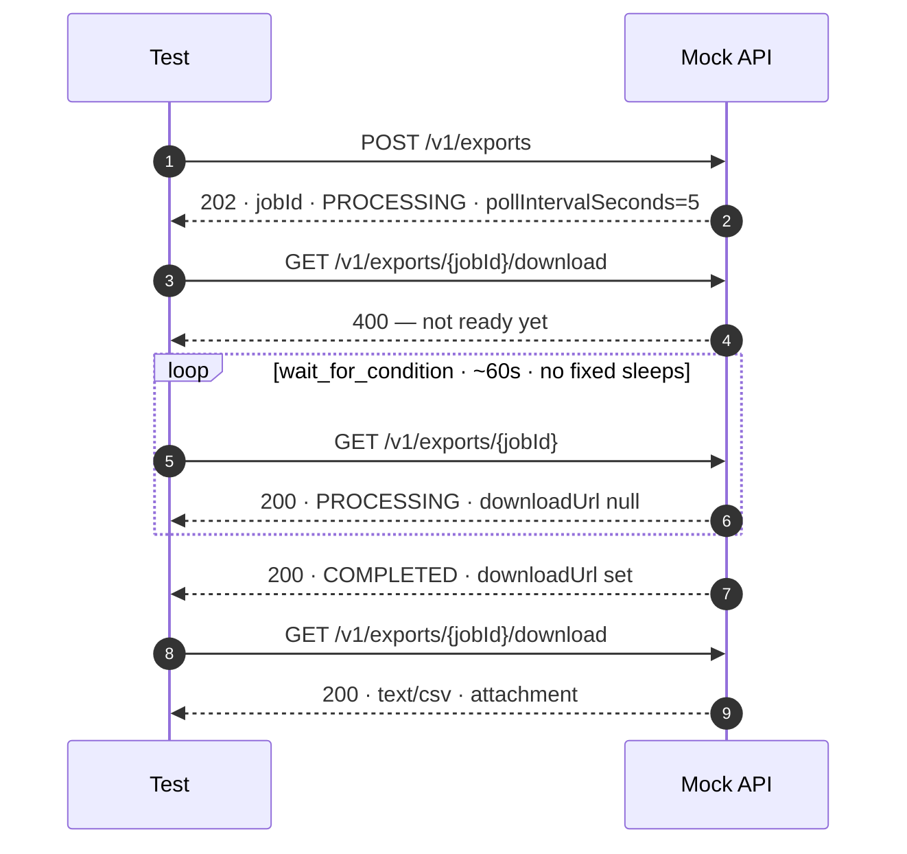
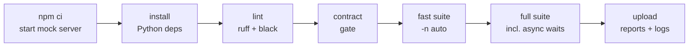

<div align="center">

# QA API Test Automation — LightBeam Assignment

**A production-shaped pytest framework for stateful, time-driven REST APIs.**

[](#-coverage-at-a-glance)
[](TEST_PLAN.md)
[](requirements.txt)
[](requirements.txt)
[](.github/workflows/ci.yml)
[](pyproject.toml)

</div>

<!-- After pushing, swap the static CI badge above for the live one:
     [](https://github.com/<user>/<repo>/actions/workflows/ci.yml) -->

Validates the LightBeam order/export mock service end to end: auth, the order state machine,
cancellation rules, and long-running CSV export jobs. Test data lives in YAML, so adding a scenario
is usually a YAML edit rather than a code change.

The system under test is the assignment's own Node/Express mock server, vendored unmodified into
this repo. It is **stateful and time-based**: orders and export jobs advance through statuses purely
from elapsed wall-clock time, with no client action required — which is what makes polling, not
sleeping, the central design problem.

---

## 📊 At a glance

| | |
|---|---|
| **Tests** | **45 passed / 0 failed** — verified against a live instance of the vendored server |
| **Fast suite** | 40 tests in **< 1s** (includes the Hypothesis property test's 25 generated examples) |
| **Async suite** | 5 tests, **~61s** parallel (`-n 5`) / ~115s serially — real 5s / 15s / 60s server timers |
| **Endpoint coverage** | 7 of 7, each with positive **and** negative cases |
| **Defects found in the SUT** | 3, pinned by characterization tests |
| **Fixed sleeps in the suite** | 0 — every wait goes through `wait_for_condition` |

**Contents** · [Quick start](#-quick-start) · [Architecture](#-architecture) ·
[What is under test](#-what-is-under-test) · [Coverage](#-coverage-at-a-glance) ·
[Reporting](#-html-report) · [Logging](#-logging) · [Dependencies](#-why-these-dependencies) ·
[Server contract](#-confirmed-server-contract) · [CI](#-ci) · [Limitations](#-known-limitations)

---

## 🚀 Quick start

Two terminals: one for the system under test, one for the suite.

```bash
# terminal 1 — the mock server
cd mock-server && npm ci && node server.js

# terminal 2 — the test suite
python3 -m venv .venv && source .venv/bin/activate
pip install -r requirements.txt
python scripts/validate_contract.py     # contract pre-flight: fails fast if the server drifted
pytest -q                               # 45 tests, ~115s (includes the real async waits)
```

<details>
<summary><b>Windows PowerShell</b></summary>

```powershell
python -m venv .venv
.venv\Scripts\Activate.ps1
pip install -r requirements.txt
python scripts\validate_contract.py
pytest -q
```

If `Activate.ps1` errors with an execution-policy message, either run
`Set-ExecutionPolicy -Scope CurrentUser RemoteSigned` once, or skip activation entirely:

```powershell
.venv\Scripts\python.exe -m pip install -r requirements.txt
.venv\Scripts\python.exe -m pytest -q
```

</details>

### Everyday commands

| Command | What it does |
|---|---|
| `pytest -q` | Full suite, including the ~15–75s real async waits |
| `pytest -m smoke -q` | Fastest, highest-value checks only |
| `pytest -m "not slow" -q` | Everything except the real-time waits (**< 1s**) |
| `pytest -n auto -m "not slow" -q` | Same, in parallel across CPU cores |
| `pytest --incl_tests=orders -q` | Only tests tagged `orders` (YAML tags become markers) |
| `pytest --excl_tests=slow,property -q` | Everything except slow / property-based tests |
| `pytest --html-report=reports/report.html -q` | Pin the report to a fixed path (what CI does) |
| `pytest --no-html-report -q` | Skip report generation, for fast local iteration |
| `python scripts/validate_contract.py` | Contract gate — run it whenever the mock server changes |
| `ruff check . && black --check .` | Lint and format check (same as CI) |

---

## 🏗 Architecture



```
lightbeam-qa-api-automation/
├── mock-server/           Vendored, unmodified copy of the assignment's Gist mock server
├── config/                Per-environment .properties (qa/stg/prd) — no secrets in the repo
├── utilities/             api_client · polling · soft_assert · steps · data_loader · payload_builders
├── plugins/               pytest plugin + Jinja2 HTML report template
├── testcases/             YAML scenarios (the feature-file analogue)
├── step_definitions/      pytest functions that consume testcases/
├── scripts/               Contract pre-flight check for CI
├── conftest.py            Registers the report plugin
├── pyproject.toml         pytest config, markers, lint config
└── .github/workflows/     CI pipeline
```

> [!NOTE]
> **BDD analogy.** `testcases/*.yaml` are the scenarios (like `*.feature` files); `step_definitions/*.py`
> are the pytest functions that execute them. Scenarios whose logic is genuinely *control flow* rather
> than *data* — the state-machine wait, cancellation timing — stay as direct pytest functions, the same
> way a reliability suite would.

### What the framework gives you

| # | Capability | Where |
|---|---|---|
| 1 | **YAML-driven cases** — `id`, `title`, `tags`, expected outcome; tags become pytest markers automatically | `testcases/`, `utilities/data_loader.py` |
| 2 | **One HTTP client per resource** — centralized auth, retry, logging, session cleanup; tests never call `requests.*` | `utilities/api_client.py` |
| 3 | **Reusable async wait** — no fixed `time.sleep()` anywhere; every wait is timeout-bound with a diagnostic error | `utilities/polling.py` |
| 4 | **Soft assertions** — one test reports *every* broken expectation, not just the first | `utilities/soft_assert.py` |
| 5 | **Step recorder + HTML report** — per-step status, timing, and detail | `utilities/steps.py`, `plugins/` |
| 6 | **Tag filters via CLI** — `--incl_tests` / `--excl_tests` | `plugins/report_plugin.py` |
| 7 | **Parallel execution** — `pytest -n auto`; every test creates its own data, so workers never collide | `pytest-xdist` |
| 8 | **Env-agnostic config** — `${VAR:-default}` placeholders, switch with `TEST_ENV` | `config/` |
| 9 | **Property-based invariant** — random item lists check `totalAmount` beyond hand-written cases | `step_definitions/test_invariants.py` |

---

## 🔍 What is under test

### Order state machine

Status is recomputed from `createdTimestamp` on **every read** — reading never drives the transition.



### Async export job



---

## ✅ Coverage at a glance

| Endpoint | Positive | Negative / boundary | Auth enforced |
|---|:--:|:--:|:--:|
| `POST /v1/auth/login` | ✅ token + `expiresIn` | ✅ 5 cases (missing / empty credentials) | n/a |
| `POST /v1/orders` | ✅ 202 · PENDING · total | ✅ 10 cases (payload, correlation ID, types) | ✅ |
| `GET /v1/orders/:id` | ✅ full persisted body | ✅ 404 · read-only proof | ✅ |
| `DELETE /v1/orders/:id` | ✅ PENDING & PROCESSING | ✅ 409 on COMPLETED · 404 · double-cancel | ✅ |
| `POST /v1/exports` | ✅ 202 · jobId · poll hint | — | ✅ |
| `GET /v1/exports/:jobId` | ✅ PROCESSING → COMPLETED | ✅ 404 · no URL while in flight | ✅ |
| `GET /v1/exports/:jobId/download` | ✅ 200 · `text/csv` · attachment | ✅ 400 early · 404 unknown | ✅ |

Full requirement → test traceability matrix, the defects found, and the assumptions behind each
decision live in **[`TEST_PLAN.md`](TEST_PLAN.md)**.

### Tags for `--incl_tests` / `--excl_tests`

| Tag | Meaning |
|---|---|
| `smoke` | Fast, highest-value checks safe to run on every PR |
| `auth` | Login and authorization-enforcement scenarios |
| `orders` | Order creation, state machine, and cancellation |
| `exports` | Export job creation, status, and download |
| `validation` | Bad-input / missing-field rejections |
| `boundary` | Edge-of-input cases (empty arrays, empty header/credential values, decimal pricing, zero quantity) |
| `happy` | Successful, positive-path scenarios |
| `api` | Scenarios asserting the API response contract |
| `regression` | Broader authorization / edge-case coverage |
| `slow` | Tests that wait out real async timing (~15–75s) |
| `invariant` · `property` | Hypothesis-driven property tests |

---

## 📄 HTML report

> [!TIP]
> **A real report from a real run is committed at [`docs/sample-report.html`](docs/sample-report.html)**
> — the full 45-test suite, green, with the per-step detail expanded on click. Download it and open
> it locally, or view it through [htmlpreview.github.io](https://htmlpreview.github.io/) (GitHub
> shows HTML files as source, it doesn't render them). The DEBUG trace of that same run is beside it
> at [`docs/sample-run.log`](docs/sample-run.log).

Every run (unless `--no-html-report`) writes a fresh report to its own timestamped folder, so
previous runs are preserved:

```
reports/custom_report_<YYYYMMDD_HHMMSS>/
├── report.html     ← totals, per-test titles, steps, tracebacks, captured logs
└── run.log         ← DEBUG-level trace of the whole run
```

The paths are printed in a banner at the end of the run — the `file://` line is clickable in most
terminals:

```
==============================================================================
  HTML REPORT  (passed=45, failed=0, error=0, skipped=0, total=45)
  file:///Users/you/.../reports/custom_report_20260912_180925/report.html
  /Users/you/.../reports/custom_report_20260912_180925/report.html
  run log: /Users/you/.../reports/custom_report_20260912_180925/run.log
==============================================================================
```

Each row shows the test's **human-readable title**, its tags, outcome, and duration; expanding a row
reveals its named steps with per-step timing and `SoftAssert` detail, plus — for anything that did
not pass — the traceback and the captured log.

### Test case titles

The report reads titles, not function names:

> ✅ `Validate that the login API rejects a request with no apiKey`
> ❌ `test_login_validation[missing_api_key]`

> [!IMPORTANT]
> **Every title starts with `Validate that `**, and this is *enforced at collection time* by
> `plugins/report_plugin.py` — the same posture as pytest's `--strict-markers`, already on in this
> repo. A title that breaks the convention fails the run before a single request is sent, and the
> error names every offender at once.

Resolution order, most explicit first:

| Order | Source | Applies to |
|:--:|---|---|
| 1 | **YAML `title:`** — mandatory; a case without one fails at collection | Every case in `testcases/*.yaml` |
| 2 | **`@pytest.mark.title("...")`** | The direct pytest tests (state machine, cancellation, async waits) |
| 3 | Docstring first line → prettified function name | Safety net only; neither satisfies the convention check, so an unlabelled test fails the run |

```yaml
  - id: empty_api_key
    title: Validate that the login API rejects an apiKey that is present but empty
    tags: [auth, validation, boundary]
```

```python
@pytest.mark.slow
@pytest.mark.title("Validate that the orders API cancels an order while it is PROCESSING")
def test_cancel_order_while_processing_succeeds(order_client, settings):
```

Terminal output and `-k` selection still use pytest node ids — titles are a reporting concern, not a
renaming of the tests. `reports/` is not checked into git.

---

## 🪵 Logging

Three destinations, each answering a different question:

| Where | What is in it | When you want it |
|---|---|---|
| **Terminal** — `Captured log call` | INFO records for the failing test only | Debugging the failure in front of you |
| **HTML report** — inside the failed row | The same captured log / stdout / stderr, under the traceback | Triaging someone else's run, or CI, without shell access |
| **`run.log`** — beside the report | The whole run at **DEBUG**: request bodies, response bodies, urllib3 connection lines | "It passed locally and failed in CI" — CI uploads it as an artifact |

Every request logs method, path, status, duration, and correlation id. Response bodies log at DEBUG
(present in `run.log`, absent from a green terminal) — **except error responses, which log at INFO**,
so the server's own message sits right there in a failure's captured log:

```
------------------------------ Captured log call -------------------------------
2026-09-12 20:45:33 [INFO] utilities.api_client: POST /orders -> 400 (1ms) corr_id=34593dfd-…
2026-09-12 20:45:33 [INFO] utilities.api_client: POST /orders error body: {"error":"Invalid payload"}
```

Bearer tokens are masked in every path and bodies are truncated, so one large payload cannot bury the
log. Passing tests deliberately carry no captured-output block in the HTML report — their records are
all in `run.log`. Under `pytest -n auto` each worker writes `run-gw0.log`, `run-gw1.log`, … into the
same report directory, so parallel processes never interleave into one file handle.

<details>
<summary><b>Why this needed fixing</b></summary>

`utilities/logger.py` previously attached its own handler and set `propagate = False`, so records
never reached the root logger — which is exactly where pytest's log capture attaches. Logs still
appeared in the terminal, but only incidentally, as `Captured stderr`: `caplog` would have seen
nothing, `--log-file` would have written an empty file, and the HTML report contained zero log lines.
Loggers now propagate and pytest owns the handlers; entry points that run outside pytest (the
contract script) call `configure_stream_logging()`.

</details>

---

## 📦 Why these dependencies

| Library | Why it is here | Where it shows up |
|---|---|---|
| `requests` | HTTP client for every call. The suite is fully synchronous, so `httpx`'s async support would buy nothing. | `utilities/api_client.py` |
| `pytest` | The runner: fixtures, parametrize, markers, plugin hooks. | Everywhere |
| `pytest-xdist` | Parallel execution via `-n auto`. Every test creates its own data, so workers never collide. | Runtime; report written by the controller only |
| `PyYAML` | Parses the YAML test-case files. | `utilities/data_loader.py` |
| `Jinja2` | Templating for the custom HTML report. | `plugins/templates/report.html.j2` |
| `hypothesis` | Property-based testing — random item lists check `totalAmount` across input space hand-written cases cannot cover. | `step_definitions/test_invariants.py` |
| `pytest-html` | Plain fallback report if you'd rather not use the custom plugin. | Optional: `--html=… --self-contained-html` |

**Pinning convention.** Every line is `>=X.Y,<MAJOR+1` — e.g. `requests>=2.32,<3.0` accepts any 2.x
at or above 2.32 and refuses 3.x, so CI picks up patch fixes without breaking on a major release.

**Deliberately absent:** `ruff`/`black` (lint-only, installed by CI to keep the runtime set small);
any mocking library (every test hits the real server over real HTTP); any ORM or DB driver (the SUT
has no database — all state lives in the server's in-memory `Map`).

---

## 🧾 Confirmed server contract

Read verbatim from `mock-server/server.js` and confirmed live. Some of it differs from a literal
reading of the brief, and the tests are written against the **actual** behavior:

| Area | Actual behavior |
|---|---|
| **Auth** | Presence-only. `checkAuth` accepts `Bearer <anything>`; the token value is never validated, and `/auth/login` accepts any non-empty `username`/`apiKey`. There is no meaningful "invalid token" 401 against this server. |
| **Order validation** | Presence-only, not range- or type-checked. A negative `quantity` is accepted and flows into `totalAmount`; an item with no `quantity` yields `totalAmount: null` (JavaScript `NaN`) with a 202. |
| **`CANCELLED`** | A real, sticky status — a cancelled order never advances again, and cancelling twice succeeds twice (200, not 404/409). |
| **Exported CSV** | Static and hardcoded, not generated from the orders a run creates. |

> [!WARNING]
> The two validation gaps above are **defects**, not features. They are pinned by characterization
> tests in `TestKnownServerValidationGaps` so they show up in the report and any future tightening of
> server-side validation surfaces as a deliberate test change — see [`TEST_PLAN.md`](TEST_PLAN.md).

---

## ⚙️ CI



The server-readiness loop **fails the job loudly** (with the server log) if the mock server never
comes up, rather than falling through and letting every later step die on a confusing connection
error. The whole `reports/` tree — HTML reports *and* DEBUG run logs — is uploaded as a build
artifact, plus the mock server's own log when the job fails.

`mock-server/package-lock.json` is committed on purpose so CI can use `npm ci` and install the exact
dependency tree rather than resolving fresh versions on every run.

---

## ⚠️ Known limitations

> [!NOTE]
> **Step detail in the HTML report is a serial-run feature.** Under `pytest -n auto` the report is
> written once, by the xdist controller. Per-step data is built inside worker processes, and pytest
> does not carry custom report attributes across the worker/controller boundary — totals, outcomes,
> durations, tracebacks, and captured logs are all present; the expandable step lists are not. Run
> without `-n` when you want them.

> [!NOTE]
> **No load or concurrency testing.** The async endpoints are exercised for correctness, not under
> contention — the mock server implements no rate limiting or concurrency control to test against.

> [!NOTE]
> **CSV assertions check structure, not data.** The server returns a static CSV regardless of the
> orders a run creates, so the download test asserts the header, column count, and content type
> rather than specific row values.

### What is real vs. adopted-as-reference

Every test exercises the actual mock server over real HTTP — no mocking, no stubbed responses. The
server's own quirks are documented above rather than worked around.

Adopted from a structured SDET framework pattern, and genuinely beyond a minimal solution: YAML-driven
data tests, the custom HTML report plugin, lint config, the contract pre-flight script, and the
Hypothesis property test. Out of scope: load/concurrency testing, Dockerizing the mock server, and
mutation testing of the suite itself.
