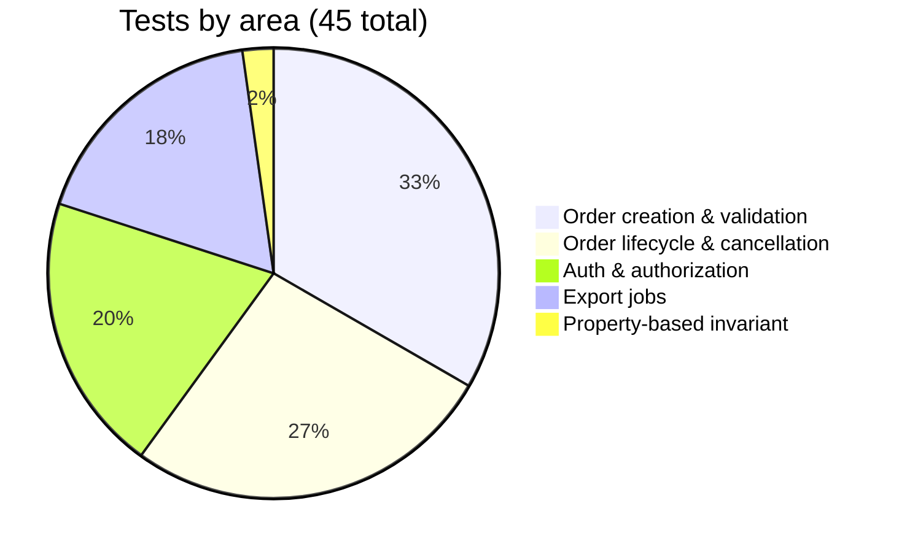

<div align="center">

# 🧪 Test Plan & Traceability Matrix

**LightBeam QA API Test Automation**

[](#-test-inventory)
[](#-traceability-matrix)
[](#-defects-found-in-the-system-under-test)
[](#-how-this-plan-is-verified)

</div>

| Run | Tests | Duration | Notes |
|---|:--:|---|---|
| Fast (`-m "not slow"`) | **40** | **< 1s** serial | Includes the Hypothesis property test's 25 generated examples |
| Async (`-m slow`) | **5** | **~61s** at `-n 5` | Waits out the server's real 5s / 15s / 60s timers |
| Full (`pytest`) | **45** | ~115s serial | 45 passed · 0 failed · 0 error · 0 skipped |

Contract pre-flight (`scripts/validate_contract.py`) passes against the same live server.

**Contents** · [Server contract](#-confirmed-server-contract) · [Traceability](#-traceability-matrix) ·
[Test inventory](#-test-inventory) · [Defects](#-defects-found-in-the-system-under-test) ·
[Diagnostics](#-failure-diagnostics) · [Safeguards](#-anti-vacuous-test-safeguards) ·
[Titles](#-test-case-titles) · [Assumptions](#-assumptions)

---

## 📐 Confirmed server contract

Read directly from `mock-server/server.js` and confirmed against a running instance — **not inferred
from the brief**. Where the two disagree, the tests follow the server and the difference is recorded
here.

| Area | Confirmed behavior |
|---|---|
| **Auth** | `checkAuth` only verifies the `Authorization` header starts with `"Bearer "` — the token value itself is never validated. `/auth/login` accepts any non-empty `username`/`apiKey` and returns `{ token, expiresIn: 3600 }`. |
| **Correlation ID** | Must be present **and non-empty** on `POST /orders` (the check is falsy-based); not echoed, not format-checked. |
| **Order validation** | Presence-only: missing `customerId` / `items` (non-empty array) / `shippingAddress` → 400. No range or type validation on `quantity` / `unitPrice`. |
| **Order state** | Recomputed from `createdTimestamp` on every read: `>= 15000ms` → COMPLETED, `>= 5000ms` → PROCESSING, else PENDING. Reads never drive the transition. |
| **Order read model** | `GET /orders/:id` returns the full persisted resource (`customerId`, `items`, `shippingAddress`, `totalAmount`, `createdAt`) plus an internal `createdTimestamp`. |
| **Cancellation** | Sets `CANCELLED` (sticky, never advances again). 409 only if already COMPLETED. Cancelling twice succeeds twice (200, not an idempotency error). |
| **Exports** | No request validation. `POST /exports` → `{ jobId, status: PROCESSING, pollIntervalSeconds: 5 }`. COMPLETED once `>= 60000ms` elapsed, at which point `downloadUrl` is populated (`null` before). Download: 400 while processing; 200 + `text/csv` + `Content-Disposition: attachment; filename="orders_report.csv"` once complete, with a static hardcoded CSV body. |
| **Errors** | Every error response is `{ "error": "<message>" }`. |

---

## 🔗 Traceability matrix

Every endpoint and every documented behavior in the assignment table has at least one test. The auth,
correlation-ID, and export-status rows each have both a positive and a negative case.

### `POST /v1/auth/login`

| Requirement | Test(s) |
|---|---|
| Returns a Bearer token | `test_auth.py::TestLogin::test_login_with_valid_credentials_returns_token` — asserts the token **and** the `expiresIn` lifetime |
| Token is required on protected routes | `TestAuthorizationEnforcement::test_protected_route_without_token_returns_401`, `…_with_non_bearer_scheme_returns_401` |
| Token is actually usable | `TestLogin::test_login_token_is_accepted_on_a_protected_route` — asserts the exact 404 from the handler, not merely "not 401" |
| Negative / boundary credentials | `test_login_validation[missing_username \| missing_api_key \| empty_body \| empty_username \| empty_api_key]` · YAML: `testcases/auth.yaml` |

### `POST /v1/orders`

| Requirement | Test(s) |
|---|---|
| 202 Accepted, initial status PENDING | `test_orders_create.py::test_order_creation[valid_multi_item_order \| single_item_order]` · YAML: `testcases/orders_create.yaml` |
| `totalAmount` = Σ(quantity × unitPrice) | `test_order_creation[*]` — every 202 case recomputes the total independently — plus `test_invariants.py::test_total_amount_holds_for_any_item_list` (Hypothesis, 25 generated item lists per run) |
| `X-Correlation-ID` required | `test_create_order_without_correlation_id_returns_400` (header absent) and `test_create_order_with_empty_correlation_id_returns_400` (present but empty) |
| Payload validation | `test_order_creation[missing_customer_id \| missing_items \| empty_items_array \| missing_shipping_address \| items_wrong_type \| null_items]` |
| Pricing boundaries | `test_order_creation[decimal_pricing \| zero_quantity_line \| single_item_order]` |
| Auth enforced | `test_create_order_without_auth_returns_401` |

### `GET /v1/orders/:orderId`

| Requirement | Test(s) |
|---|---|
| Returns the persisted order | `test_orders_lifecycle.py::test_get_order_returns_the_persisted_order` — every submitted field round-trips; `totalAmount` recomputed independently |
| State machine PENDING → PROCESSING → COMPLETED | `test_order_transitions_pending_to_processing_to_completed` |
| Reading is side-effect free | `test_get_order_does_not_itself_mutate_state` — repeated reads inside the server's 5s PENDING window |
| Unknown order → 404 · auth enforced | `test_get_nonexistent_order_returns_404`, `test_get_order_without_auth_returns_401` |

### `DELETE /v1/orders/:orderId`

| Requirement | Test(s) |
|---|---|
| Cancels during PENDING | `test_cancel_order_while_pending_succeeds` |
| Cancels during PROCESSING | `test_cancel_order_while_processing_succeeds` |
| 409 Conflict once COMPLETED | `test_cancel_order_after_completed_returns_409` |
| Auth enforced | `test_cancel_order_without_auth_returns_401` |
| Cancel twice · unknown order · stays cancelled | `test_cancelling_twice_is_idempotent`, `test_cancel_nonexistent_order_returns_404`, `test_cancelled_order_never_advances_state` |

### `POST /v1/exports` · `GET /v1/exports/:jobId` · `…/download`

| Requirement | Test(s) |
|---|---|
| 202 Accepted + `jobId` | `test_exports.py::test_export_fast_paths[create_export_returns_job]` — also asserts the advertised `pollIntervalSeconds` |
| Status while incomplete | `test_export_fast_paths[status_while_processing_has_no_download_url]` — 200 + PROCESSING + `downloadUrl` still null |
| PROCESSING → COMPLETED after ~60s | `test_export_completes_and_download_returns_valid_csv` — covers the transition and the download in one real-time wait |
| Download rejected while incomplete | `test_export_fast_paths[download_before_completion_rejected]` — 400 |
| Download 200 + `text/csv` + payload | `test_export_completes_and_download_returns_valid_csv` — status, `Content-Type`, `Content-Disposition` attachment/filename, header row, and no ragged rows |
| Unknown `jobId` → 404 (status & download) | `test_export_fast_paths[status_for_unknown_job_is_404 \| download_for_unknown_job_is_404]` |
| Auth enforced | `test_create_export_without_auth_returns_401`, `test_export_status_and_download_require_auth` |

---

## 📋 Test inventory

| Area | File | Tests | Of which `slow` |
|---|---|:--:|:--:|
| Auth & authorization | `test_auth.py` | 9 | — |
| Order creation & validation | `test_orders_create.py` | 15 | — |
| Order lifecycle & cancellation | `test_orders_lifecycle.py` | 12 | 4 |
| Export jobs | `test_exports.py` | 8 | 1 |
| Property-based invariant | `test_invariants.py` | 1 | — |
| **Total** | | **45** | **5** |



### Markers / tags

`smoke` · `orders` · `exports` · `auth` · `api` · `regression` · `validation` · `boundary` · `happy` ·
`invariant` · `property` · `slow` (real async waits, ~15–75s) · `title` (report metadata).

Tags on YAML cases become these markers automatically via `utilities/data_loader.py`. Filter with
`--incl_tests=<tag>` / `--excl_tests=<tag>` (added by `plugins/report_plugin.py`) or plain
`pytest -m <marker>` — both work.

---

## 🐞 Defects found in the system under test

These are the mock server's **actual** behaviors, pinned by characterization tests in
`test_orders_create.py::TestKnownServerValidationGaps` so they stay visible in the report instead of
being silently tolerated. Against a real order service, each would be raised as a defect.

| # | Severity | Behavior observed | Expected of a production service | Pinned by |
|:--:|---|---|---|---|
| 1 | 🔴 High | `quantity: -2` is accepted; the order is created with `totalAmount: -20` | 400 — a negative quantity is not a purchasable line | `test_negative_quantity_is_currently_accepted` |
| 2 | 🔴 High | An item with no `quantity` yields `totalAmount: null` (JS `NaN` serialized to null) and still returns 202 | 400 — or at minimum, never a null monetary total | `test_item_without_quantity_yields_a_null_total` |
| 3 | 🟠 Medium | Auth accepts any `Bearer <anything>`; the token value is never validated | A forged or expired token must be rejected with 401 | Not testable against this server — documented above |

> [!NOTE]
> Pinning them as tests is deliberate. If server-side validation is ever tightened, these tests fail
> and the fix surfaces as a **reviewed, intentional** test change rather than silent behavior drift.

---

## 🔬 Failure diagnostics

A failing test is only useful if it explains itself. Every failure carries:

| Artifact | Contents |
|---|---|
| **Assertion output** | All soft-assertion failures at once, not just the first, plus the traceback |
| **Captured log** (terminal + HTML report) | Every request's method, path, status, duration, correlation id — and the response body for any 4xx/5xx |
| **`run.log`** (beside the HTML report) | The whole run at DEBUG, including request bodies; uploaded by CI as a build artifact |

Bearer tokens are masked in every log path, and bodies are truncated so one large payload cannot bury
the log.

---

## 🛡 Anti-vacuous-test safeguards

The most dangerous outcome a suite can produce is a green test that checked nothing. Two guards exist
specifically to make that impossible:

| Guard | Prevents |
|---|---|
| `SoftAssert.assert_all()` fails when zero checks were recorded | A test whose assertions were skipped — an unmatched branch, an early return — reporting as passed |
| `test_exports.py` resolves each YAML case id through an explicit `CASE_HANDLERS` registry and calls `pytest.fail` for an unregistered id | A new YAML case falling off the end of an if/elif chain and silently asserting nothing |

---

## 🏷 Test case titles

Every test carries a human-readable title, and that title — not the pytest node id — is what the HTML
report shows. Every title starts with **`Validate that `**, so the report reads as a list of claims
about the system:

> **Validate that the login API returns a bearer token and expiry for valid credentials**

| Source | Scope | Enforcement |
|---|---|---|
| YAML `title:` field | Every case in `testcases/*.yaml` | Mandatory — `utilities/data_loader.py` fails collection if missing, so the YAML stays the single source of truth |
| `@pytest.mark.title("…")` | The direct pytest tests | Applied to all of them |
| Docstring first line → prettified name | Safety net only | Neither satisfies the convention check, so an unlabelled test fails the run |

`plugins/report_plugin.py` validates every collected test's title at collection time and lists **all**
offenders at once — the same posture as pytest's `--strict-markers`, which this repo already runs with.

---

## 📌 Assumptions

- The server's timing constants (5s / 15s / 60s) are measured from resource-creation time — confirmed
  directly in source.
- No rate limiting or concurrency limits are assumed or tested; the server implements none.
- CSV assertions check **structure** (header row, column names, column count per row, `Content-Type`,
  `Content-Disposition`), not specific order data, because the server's CSV payload is static
  regardless of what orders exist.
- `cancelled_observation_seconds` (default 18s, in `config/<env>.properties`) must stay above the
  server's 15s COMPLETED threshold for `test_cancelled_order_never_advances_state` to prove anything
  — the test asserts this itself rather than trusting the config.

---

## ✔ How this plan is verified

```bash
cd mock-server && npm ci && node server.js   # terminal 1
python scripts/validate_contract.py          # terminal 2 — contract gate
pytest -q                                    # 45 tests
```

The contract gate runs one login + order + export cycle and fails fast if any response is missing a
field this suite depends on — so a drifted or replaced mock server produces one clear error instead of
forty confusing test failures.
